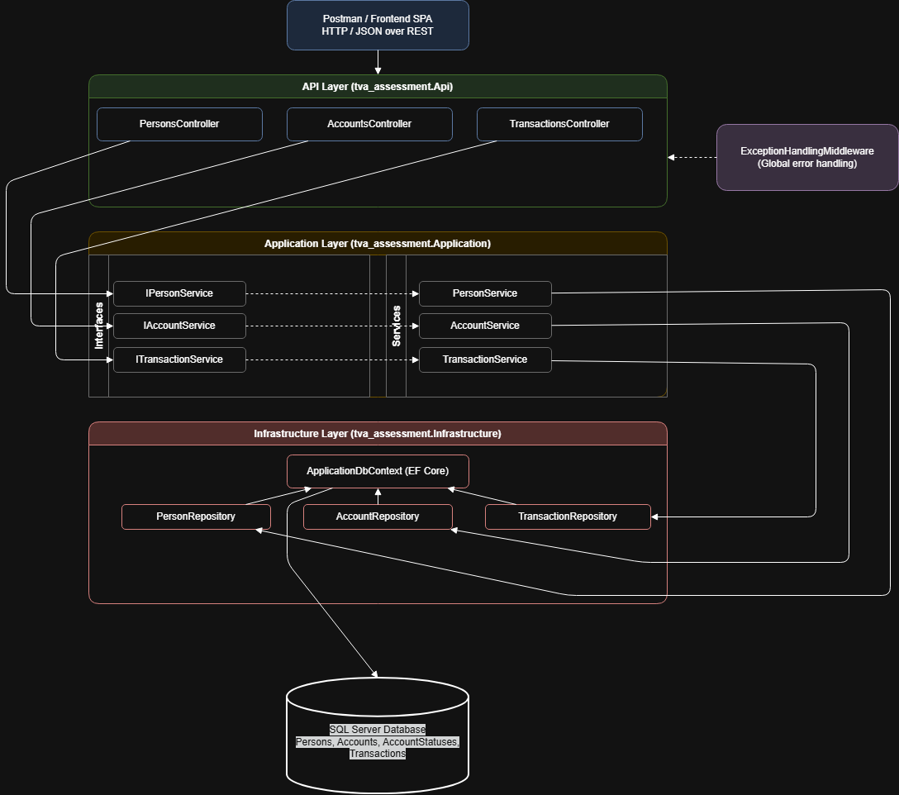
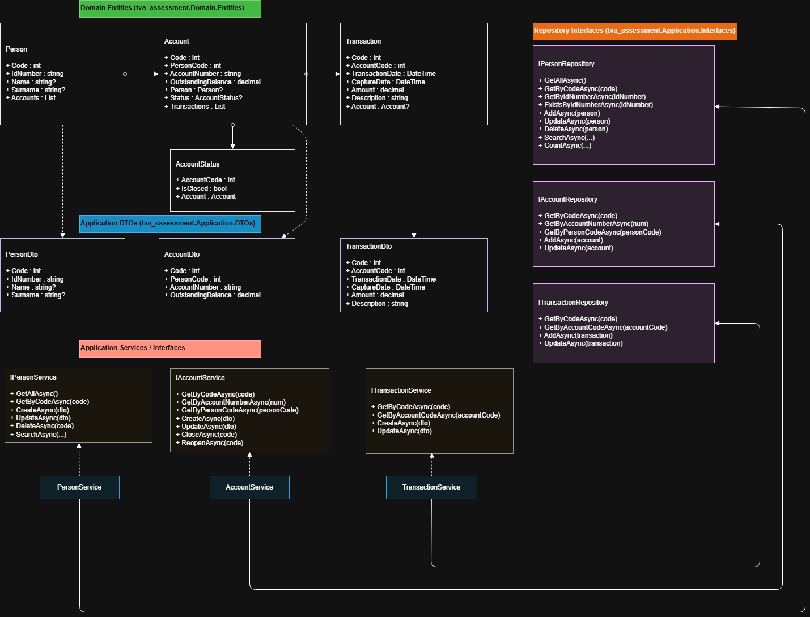
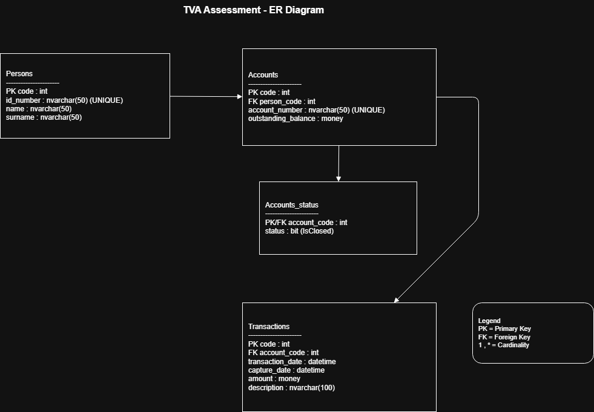

# TVA Assessment API

## 📌 Application Summary

The **TVA Assessment API** is a layered ASP.NET Core Web API that manages:

- **Persons** – Customer identity records  
- **Accounts** – Financial accounts linked to persons  
- **Transactions** – Financial movements on accounts  

The system enforces strict business rules:

- Duplicate persons are not allowed
- Duplicate account numbers are not allowed
- Transactions cannot be posted to closed accounts
- Accounts cannot be closed when the balance is not zero
- Transaction balances automatically update account balances
- All exceptions are centrally handled with consistent API responses

The solution follows **Clean Architecture principles** with clear separation of concerns between:

- API Layer (Controllers)
- Application Layer (DTOs, Services, Interfaces)
- Domain Layer (Entities)
- Infrastructure Layer (EF Core, Repositories)
- Middleware (Exception Handling)
- Test Project (Unit Testing)

---

## 🧱 Architecture Overview

The application follows a **layered architecture**:

- **API Layer** – Exposes REST endpoints
- **Application Layer** – Contains business rules and validation
- **Domain Layer** – Core business entities
- **Infrastructure Layer** – Database and EF Core implementation
- **Middleware** – Centralized exception handling
- **Test Layer** – Isolated unit testing of business logic

### 📐 Architecture Diagram

---

## 🧩 Class Diagram

The class diagram illustrates the relationships between:

- Controllers
- Services
- Repositories
- DTOs
- Domain Entities

---

## 🗄️ Entity Relationship Diagram (ERD)

The ERD shows the database structure and relationships between:

- Person  
- Account  
- AccountStatus  
- Transaction  

---

## 🧪 Testing Strategy

Unit testing is implemented using:

- **NUnit 3** – Test framework  
- **Moq** – Dependency mocking  
- **FluentAssertions** – Readable assertions  

Core business logic is verified through:

- `PersonServiceTests`
- `AccountServiceTests`
- `TransactionServiceTests`
- `ExceptionHandlingMiddlewareTests`

All critical business rules are fully validated.

---

## 🔗 API Testing (Postman)

A complete Postman collection and environment are provided for manual API testing.

### 📁 Postman Files

- **Collection:**  
  `documentation/postman/tva_assessment.postman_collection.json`

- **Environment:**  
  `documentation/postman/tva_assessment.postman_environment.json`

### ✅ How to Use Postman

1. Open **Postman**
2. Click **Import**
3. Import both:
   - The **collection**
   - The **environment**
4. Select the environment
5. Start testing the endpoints

---

## ⚙️ Technologies Used

- ASP.NET Core (.NET 8)
- Entity Framework Core
- SQL Server
- Swagger / OpenAPI
- NUnit 3
- Moq
- FluentAssertions
- Draw.io (Diagrams)
- Postman (API Testing)

---
